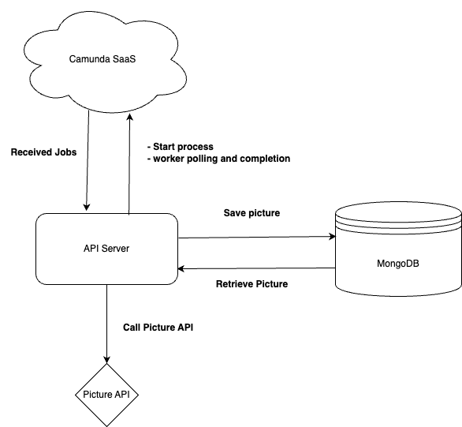

# Getting Started

## Running the Application

### Docker Compose Method

#### Setting up the Environment Variables

Before you start the application, you need to set up your environment variables.
These contain the connection info to your Camunda SaaS Cluster.
This can be done by creating a `.env` file in the root directory of the project.

Here's an example of what your `.env` file should look like:

```env
CAMUNDA_SAAS_REGION=your_region
CAMUNDA_SAAS_CLIENT_ID=your_client_id
CAMUNDA_SAAS_CLIENT_SECRET=your_client_secret
CAMUNDA_SAAS_CLUSTER_ID=your_cluster_id
PORT=8080
DATABASE_URL=mongodb-url
```

#### Running the application

```
docker compose up -d
```

This starts the Spring Boot client (port 8080) and the MongoDB instance to store the pictures.

### Helm Method

#### Setting up the Environment Variables

Before you start the application, you need to set up the environment variables.
These contain the connection info to your Camunda SaaS Cluster.
This can be done by replacing the placeholders in the [configmap file](./helm/templates/configmap.yaml) with your values.

#### Deploying the Application

```
helm install camunda-animal-picture-app ./helm
```

This will deploy the application to your Kubernetes cluster.  
Again you can access the Spring Boot client (port 8080).

You will need to find out the IP addresses of the pods to access the services.

you can port-forward the services to your local machine:

```
kubectl port-forward <backend-pod> 8080:8080
```

## Usage

### REST API

Deploy the BPMN process using the API:
Note: to use the deploy API you need to specifie the following informations inside the [application.yaml](./backend/src/main/resources/application.yml)

```example application.yml
bpmn:
  resourcePath: bpmn/animal-picture-process.bpmn
  resourceName: animal-picture-process-01.bpmn
```

```
POST localhost:8080/api/deploy
```

Bash:

```
curl -X POST localhost:8080/api/process/start
```

Starting a new process (returns processInstanceKey):

```
POST localhost:8080/api/process/start
```

Bash:

```
curl -X POST localhost:8080/api/process/start
```

After completing the User Task, the Job Worker will start retrieving the picture from the API and store it in the DB.

To retrieve the picture (e.g. in your browser):

```
GET localhost:8080/api/pictures/{processInstanceKey}
```

# Simplified Architecture



# Limitations

## Camunda Saas

For now the application can only be configured to work with the Saas offering from Camunda.  
If you want the app to work with your self-managed instance, you would need to adjust the [application.yaml](./backend/src/main/resources/application.yml) file accordingly.
